<h1 align="center">
  
    Software Provider for Customers
  
</h1>

 
 

- 🌱 Currently, AI system, ChatGPT, AutoGPT, Chat bot, etc. are developed using Machine Learning technology and actively utilized to help Real Estate business etc.

- 🔭 We are 𝚌𝚞𝚛𝚛𝚎𝚗𝚝𝚕𝚢 𝚠𝚘𝚛𝚔𝚒𝚗𝚐 𝚘𝚗 **Application and Mobile, Web based games 𝙳𝚎𝚟𝚎𝚕𝚘𝚙𝚖𝚎𝚗𝚝.**

- 🌱 We are 𝚌𝚞𝚛𝚛𝚎𝚗𝚝𝚕𝚢 𝚕𝚎𝚊𝚛𝚗𝚒𝚗𝚐 **𝙳𝚎𝚟𝙾𝚙𝚜 𝚊𝚗𝚍 𝙲𝚘𝚖𝚙𝚎𝚝𝚒𝚝𝚒𝚟𝚎 𝙿𝚛𝚘𝚐𝚛𝚊𝚖𝚖𝚒𝚗𝚐.**

- 👯 𝙸’𝚖 𝚕𝚘𝚘𝚔𝚒𝚗𝚐 𝚝𝚘 𝚌𝚘𝚕𝚕𝚊𝚋𝚘𝚛𝚊𝚝𝚎 𝚘𝚗 **FullStack, Blockchain 𝚘𝚛 𝚆𝚎𝚋 𝙳𝚎𝚟𝚎𝚕𝚘𝚙𝚖𝚎𝚗𝚝.**

- 💬 If you want contact me.. (Telegram)[software_architecture215] ! 𝙸 𝚊𝚖 𝚑𝚊𝚙𝚙𝚢 𝚝𝚘 𝚑𝚎𝚕𝚙.

- ⚡ 𝙵𝚞𝚗 𝚏𝚊𝚌𝚝 : **𝙱𝚎𝚜𝚝 𝙿𝚊𝚛𝚝 𝙾𝚏 𝚃𝚑𝚎 𝙹𝚘𝚞𝚛𝚗𝚎𝚢 𝙸𝚜 : *𝙸𝚝 𝙴𝚗𝚍𝚜.***

 
 

#

  
  
  

#
<h3>🏆 Github Profile Trophy</h3>

  

## 🏆 Skills
- 🏆 Machine Learning, Python, AutoGPT, ChatGPT, AI System, Resful API, Finance Services, Data Analyze, etc
- 🏆 Application : Unity, Flutter, React Native, Godot, AR/VR, IOS, IPhone, Mobile App Development,
- 🌱 Frontend : React, Next, Vue, Nuxt, Angular, Jquery, Bootstrap, TailwindCSS, Material UI, React Native, Ionic
- 🔭 Backend : Ruby on Rails, Node.js, CI, Laravel, Django, Express, Loopback, Nest.js
- 🧩 Database : MySQL, PostgreSQL, MongoDB, SQLite
- 
- 💬 Language : HTML, CSS, Javascript, Typescript, Ruby, Python, PHP, Solidity, Rust
- 📫 Interesting : AI, Blockchain

## Languagers

<code></code>
<code></code>
<code></code>
<code></code>
<code></code>
<code></code>
<code></code>
<code></code>
<code></code>
<code></code>
<code></code>
<code></code>
<code></code>
<code></code>
<code></code>
<code></code>
<code></code>
<code></code>
<code></code>
<code></code>
<code></code>
<code></code>
<code></code>
<code></code>
<code></code>
<code></code>
<code></code>
<code></code>
<code></code>
<code></code>
<code></code>
<code></code>
<code></code>
<code></code>
<code></code>
<code></code>
<code></code>
<code></code>
<code></code>
<code></code>
<code></code>
 

 
  
<h2>🛠️ My Favorite Tools</h2>

  <!-- Some badges are from https://github.com/Ileriayo/markdown-badges -->

  <h3>👨‍💻 Programming and Markup Languages</h3>

  

      
      
      
      
      
      
      
      
      
      
      
      
      
      
      
      
      
      
      
      
      
      
      
  

  <h3>🧰 Frameworks and Libraries</h3>

  

      
      
      
      
      
      
      
      
      
      
      
      
      
      
      
      
      
      
      
      
      
      
      
      
      
  

  <h3>🗄️ Databases and Cloud Hosting</h3>

  

      
      
      
      
      
      
      
      
      
      
      
  

  <h3>💻 Software and Tools</h3>

  

      
      
      
      
      
      
      
      
      
      
      
      
      
      
      
      
      
      
      
      
      
      
  

 
  
<h2>🏷️ Holopin Badges</h2>

  

 

#

  

